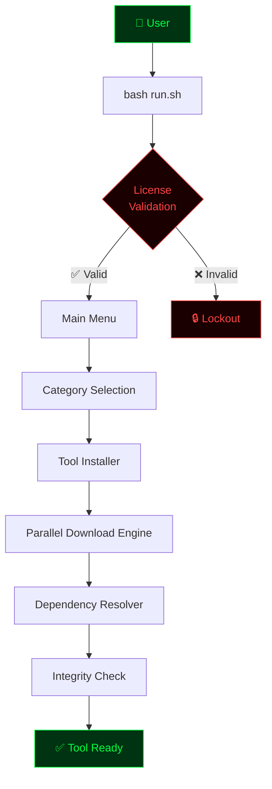
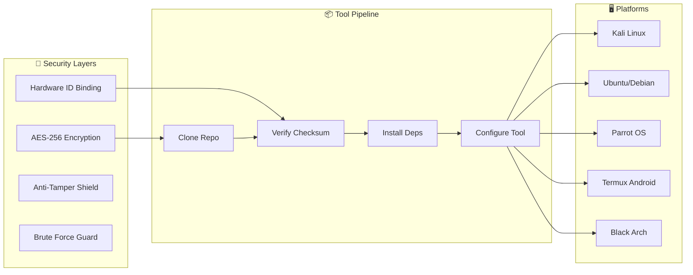
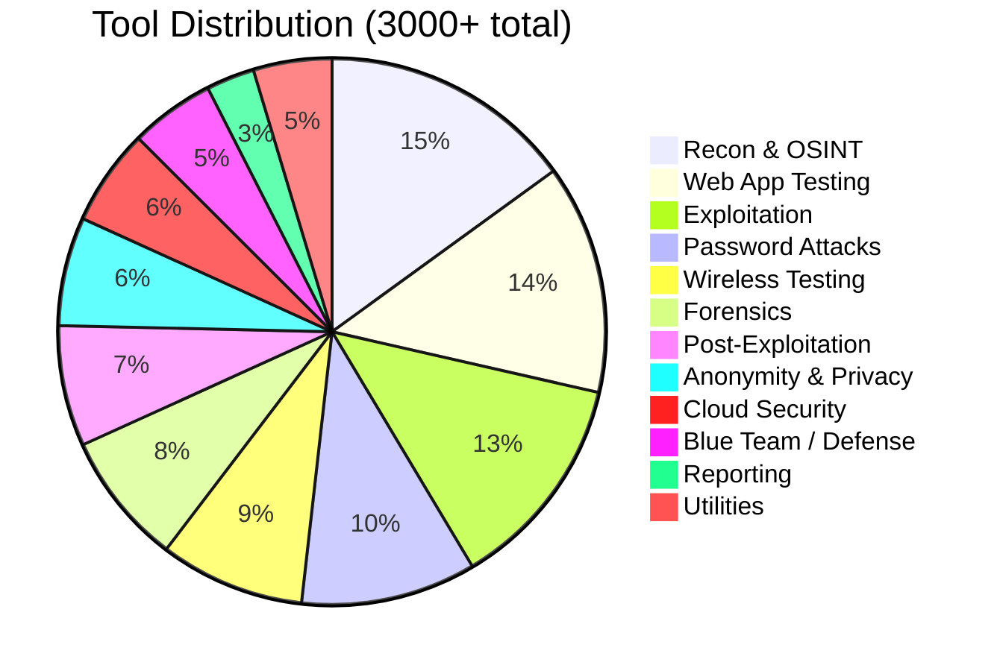
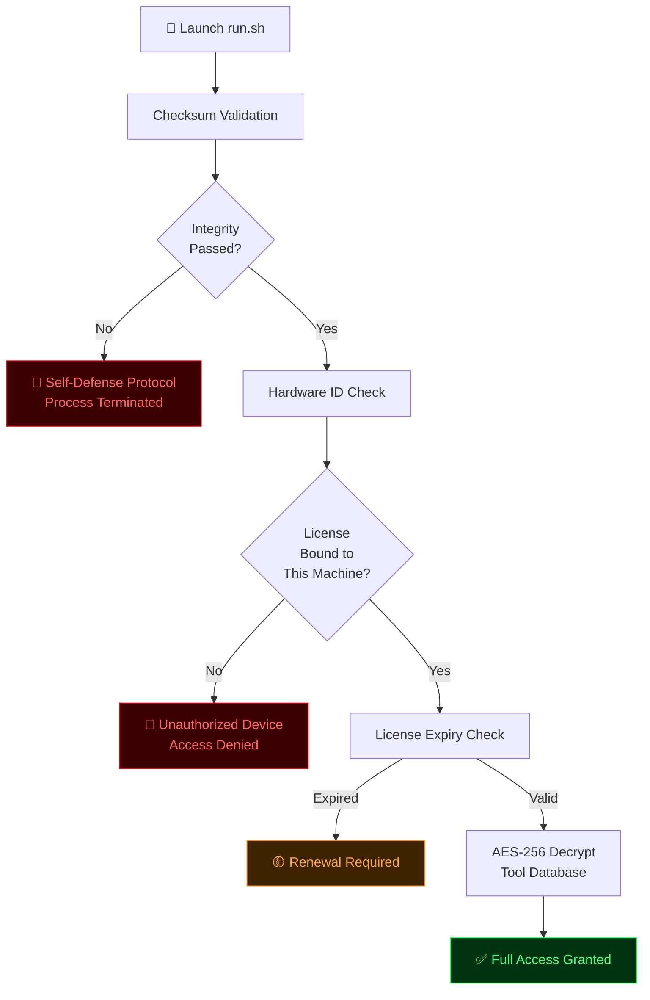
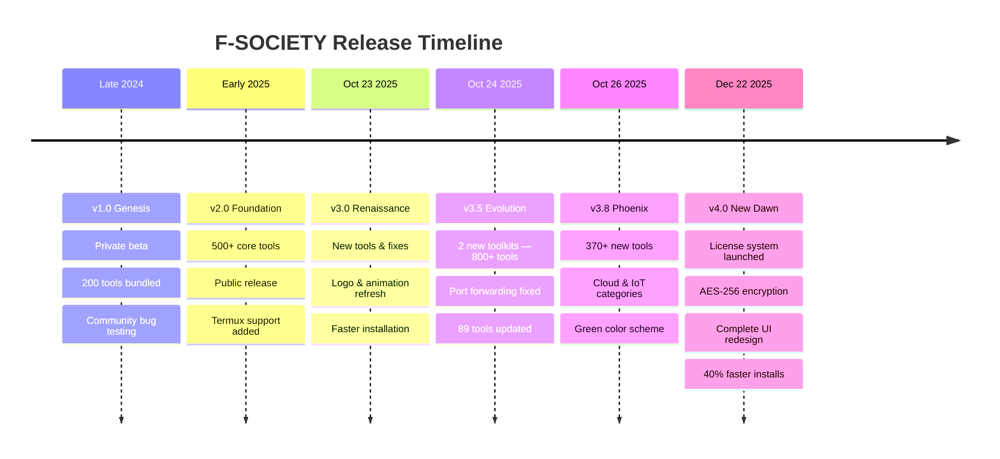

<div align="center">

```
███████╗      ███████╗ ██████╗  ██████╗██╗███████╗████████╗██╗   ██╗
██╔════╝      ██╔════╝██╔═══██╗██╔════╝██║██╔════╝╚══██╔══╝╚██╗ ██╔╝
█████╗  █████╗███████╗██║   ██║██║     ██║█████╗     ██║    ╚████╔╝ 
██╔══╝  ╚════╝╚════██║██║   ██║██║     ██║██╔══╝     ██║     ╚██╔╝  
██║           ███████║╚██████╔╝╚██████╗██║███████╗   ██║      ██║   
╚═╝           ╚══════╝ ╚═════╝  ╚═════╝╚═╝╚══════╝   ╚═╝      ╚═╝  
```

# ☠ F-SOCIETY TOOLS INSTALLER ☠
### The Ultimate Penetration Testing & Cyber Security Toolkit Framework
**Crafted with precision by ATHEX BLACK HAT**

---


</div>

---

## 📋 Table of Contents

- [Overview](#-overview)
- [Architecture](#-architecture)
- [Key Features](#-key-features)
- [Tool Categories](#-tool-categories)
- [Platform Support](#-platform-support)
- [Compatibility Matrix](#-compatibility-matrix)
- [Installation Guide](#-installation-guide)
- [Security Architecture](#-security-architecture)
- [License System](#-license-system)
- [Update History](#-update-history)
- [FAQ](#-faq)
- [Developer](#-developer)
- [Disclaimer](#️-disclaimer)

---

## 📖 Overview

**F-SOCIETY Tools Installer** is a state-of-the-art penetration testing toolkit aggregator developed for the cyber security community. Born from the vision of making advanced security tools accessible across all platforms, F-SOCIETY has evolved from a simple installer into a comprehensive framework housing **3000+ security tools** under one unified interface.

| Aspect | F-SOCIETY | Traditional Toolkits |
|---|---|---|
| Tool Count | **3000+** | 100–500 |
| Platform Support | Linux + Android + WSL | Linux Only |
| Installation | One-Click Automated | Manual Per Tool |
| Updates | Rolling / Priority | Irregular |
| Security | AES-256 + Licensed | Open Access |
| Categories | 20+ Specialized | 5–10 General |

---

## 🗺 Architecture





---

## 🔥 Key Features

### 🛠 Tool Arsenal
- **3000+ Security Tools** — largest curated collection available
- **20+ Categories** — recon to exploitation, forensics to wireless
- **Verified & Tested** — every tool validated before inclusion
- **Rolling Updates** — new tools added monthly

### 💻 Cross-Platform Support
- **Kali Linux** — native, optimized performance
- **Ubuntu / Debian / Parrot** — full compatibility
- **Black Arch** — direct repository access
- **Termux (Android)** — full mobile penetration testing
- **macOS** — experimental support
- **Windows WSL2** — partial functionality

### 🔐 Security Systems
- **AES-256-CBC Encryption** — all sensitive data protected
- **Hardware Binding** — license tied to your machine
- **Anti-Tamper Protection** — self-defense mechanisms
- **Brute Force Prevention** — 3-attempt lockout
- **Integrity Verification** — checksum validation on every run

### ⚡ Performance
- **Parallel Downloads** — significantly faster installation
- **Auto Dependency Resolution** — no manual package hunting
- **Error Recovery** — failed installs don't break your system
- **Low Resource Usage** — runs on minimal hardware (512 MB RAM minimum)

---

## 📦 Tool Categories



### 🔍 Information Gathering (Reconnaissance) — 420+ tools
> WHOIS · DNS Enumeration · Subdomain Finder · Email Harvester · Google Dork · OSINT Framework · Shodan · Metadata Extraction · Certificate Search

**Notable:** `theHarvester` `recon-ng` `sherlock` `phoneinfoga` `dmitry` `maltego`

### 🎯 Scanning & Enumeration — 280+ tools
> Port Scanning · Network Mapping · Service Detection · Vulnerability Scanning · Web Crawling · Directory Bruteforce · CMS Detection · SSL Analysis

**Notable:** `nmap` `masscan` `nikto` `whatweb` `wpscan` `gobuster` `feroxbuster`

### 💥 Exploitation — 360+ tools
> Web Exploitation · Network Exploit · Binary Exploit · SQL Injection · Command Injection · File Upload · Privilege Escalation · Buffer Overflow

**Notable:** `metasploit` `sqlmap` `beef` `searchsploit` `routersploit` `exploitdb`

### 🔑 Password Attacks — 290+ tools
> Brute Force · Dictionary Attack · Rainbow Tables · Hash Cracking · Password Spraying · Credential Stuffing · Rule-Based Attacks

**Notable:** `hydra` `john` `hashcat` `medusa` `crowbar` `crunch` `cewl`

### 🌐 Web Application Testing — 380+ tools
> XSS Detection · CSRF Testing · File Inclusion · SSRF · RCE · WAF Bypass · API Testing · GraphQL Testing

**Notable:** `burpsuite` `zap` `wfuzz` `ffuf` `commix` `xsser` `dalfox`

### 📡 Wireless Testing — 240+ tools
> WiFi Cracking · Bluetooth · RFID Cloning · WPS Attack · WPA/WPA2 · Evil Twin · Packet Injection · Signal Analysis

**Notable:** `aircrack-ng` `wifite` `fluxion` `bettercap` `hcxdumptool`

### 🕵️ Forensics — 220+ tools
> Disk Analysis · Memory Forensics · File Recovery · Timeline Analysis · Network Forensics · Malware Analysis · Steganography

**Notable:** `autopsy` `volatility` `foremost` `binwalk` `exiftool` `wireshark`

### 🔒 Post-Exploitation — 200+ tools
> Backdoor Install · Persistence · Lateral Movement · Data Exfiltration · Cover Tracks · Keylogging · Pivoting

**Notable:** `empire` `covenant` `pupy` `merlin` `sliver` `havoc`

### ☁️ Cloud Security — 160+ tools
> AWS Pentest · Azure Assessment · GCP Scanner · Container Security · IAM Auditing

**Notable:** `prowler` `scoutsuite` `cloudsploit` `cloudmapper` `pacu`

### 🛡 Blue Team / Defense — 140+ tools
> IDS/IPS Testing · Honeypot Setup · SIEM · Log Monitoring · Threat Hunting · Incident Response

**Notable:** `snort` `ossec` `wazuh` `elastic` `zeek` `suricata`

### 🎭 Anonymity & Privacy — 180+ tools
> Tor Integration · VPN Setup · Proxy Chains · MAC Changer · DNS over HTTPS · Traffic Obfuscation

**Notable:** `tor` `proxychains` `macchanger` `anonsurf` `nipe`

---

## 🖥 Platform Support

### ✅ Full Support (Production Ready)

| Platform | Version | Architecture | Status |
|---|---|---|---|
| Kali Linux | 2024.1+ | x86\_64 / ARM64 | ✅ Optimal |
| Ubuntu | 20.04 / 22.04 / 24.04 | x86\_64 | ✅ Full |
| Debian | 11 / 12 | x86\_64 / ARM64 | ✅ Full |
| Parrot OS | 5.0+ | x86\_64 | ✅ Full |
| Black Arch | Latest | x86\_64 | ✅ Full |
| Termux (Android) | Latest | ARM64 | ✅ Full |

### ⚠️ Experimental Support

| Platform | Version | Notes |
|---|---|---|
| Fedora | 38+ | Some packages unavailable |
| CentOS / RHEL | 8+ | Requires EPEL repository |
| macOS | Monterey+ | Homebrew dependencies needed |
| Windows (WSL2) | Ubuntu WSL | Limited networking tools |
| Raspberry Pi | Any | Reduced toolset |

---

## 📊 Compatibility Matrix

| Tool Category | Linux | Termux | macOS | WSL |
|---|:---:|:---:|:---:|:---:|
| Recon Tools | ✅ | ✅ | ✅ | ✅ |
| Scanning Tools | ✅ | ✅ | ✅ | ⚠️ |
| Exploitation | ✅ | ✅ | ⚠️ | ⚠️ |
| Wireless | ✅ | ❌ | ❌ | ❌ |
| Forensics | ✅ | ✅ | ✅ | ✅ |
| Web App Testing | ✅ | ✅ | ✅ | ✅ |
| Password Attacks | ✅ | ✅ | ✅ | ✅ |
| Post-Exploitation | ✅ | ✅ | ⚠️ | ⚠️ |
| Cloud Security | ✅ | ⚠️ | ✅ | ⚠️ |
| Anonymity | ✅ | ✅ | ⚠️ | ⚠️ |

> ✅ Full Support &nbsp;&nbsp; ⚠️ Partial / Experimental &nbsp;&nbsp; ❌ Not Available

---

## 📥 Installation Guide

### ⚡ One-Line Install (Recommended)

```bash
sudo apt-get update -y && sudo apt-get upgrade -y && sudo apt-get install -y git && \
git clone https://github.com/Athexblackhat/F-SOCIETY && cd F-SOCIETY && bash run.sh
```

### 🐧 Linux (Kali / Ubuntu / Debian / Parrot) — Step by Step

```bash
# 1. Update system
sudo apt-get update -y && sudo apt-get upgrade -y

# 2. Install core dependencies
sudo apt-get install -y git curl python3 python3-pip build-essential openssl

# 3. Install Python packages
pip install lolcat figlet requests colorama

# 4. Clone repository
git clone https://github.com/Athexblackhat/F-SOCIETY.git

# 5. Navigate & set permissions
cd F-SOCIETY && chmod +x run.sh src/run.sh

# 6. Run installer
bash run.sh
```

### 📱 Termux (Android)

```bash
# 1. Update Termux
pkg update -y && pkg upgrade -y

# 2. Install dependencies
pkg install git python curl openssl -y

# 3. Install Python packages
pip install lolcat figlet

# 4. Clone & run
git clone https://github.com/Athexblackhat/F-SOCIETY
cd F-SOCIETY && chmod +x f-society.sh && bash f-society.sh
```

> ⚠️ **Note:** Wireless tools require root access on Android.

### 🎩 Fedora / RHEL / CentOS

```bash
sudo dnf update -y
sudo dnf install -y git python3 python3-pip curl openssl gcc make
pip3 install lolcat figlet requests colorama
git clone https://github.com/Athexblackhat/F-SOCIETY
cd F-SOCIETY && chmod +x run.sh && bash run.sh
```

### 🍎 macOS (Homebrew Required)

```bash
/bin/bash -c "$(curl -fsSL https://raw.githubusercontent.com/Homebrew/install/HEAD/install.sh)"
brew install git python3 openssl
git clone https://github.com/Athexblackhat/F-SOCIETY
cd F-SOCIETY && bash run.sh
```

### 📁 Minimum System Requirements

| Component | Minimum | Recommended |
|---|---|---|
| RAM | 512 MB | 4 GB |
| Storage | 2 GB | 10 GB |
| Python | 3.6+ | 3.11+ |
| Git | Any | Latest |
| Shell | Bash 4.0+ | Bash 5.0+ |

---

## 🛡 Security Architecture



### Tamper Response System

| Trigger | Response |
|---|---|
| Signature removed | Immediate lockout |
| Code modified | Self-destruct sequence |
| Debug attempt detected | Process termination |
| String extraction attempt | Fake data display |
| Unauthorized device | System lockdown |

---

## 🔐 License System

> ⚠️ **F-SOCIETY is NO LONGER FREE.** A valid license key is mandatory for access as of v4.0.

### License Tiers

| Feature | Basic | Professional | Enterprise |
|---|:---:|:---:|:---:|
| Duration | 3 Months | 1 Year | **Lifetime** |
| Tools Access | 1000+ | 2500+ | **3000+** |
| Updates | Monthly | Weekly | **Priority** |
| Support | Community | Email + Chat | **24/7 Dedicated** |
| Custom Tools | ❌ | ✅ Request | ✅ Unlimited |
| Commercial Use | ❌ | ✅ | ✅ |
| API Access | ❌ | ✅ | ✅ |
| Training | ❌ | Basic | **Advanced** |

### How to Purchase

```
📱  WhatsApp : +92 349-0916663
🐙  GitHub   : github.com/Athexblackhat
⏱  Response : Within 24 hours
🕐  Hours    : Mon–Fri 09:00–22:00 PKT · Sat 12:00–18:00 PKT
```

### Activation

```bash
bash run.sh
# Enter license key when prompted:
# Enter License Key: XXXX-XXXX-XXXX-XXXX
# ✅ License Activated Successfully!
```

---

## 📅 Update History



### 🔥 v4.0 — "New Dawn" *(December 22, 2025)*

<details>
<summary><b>View full changelog</b></summary>

**Major Changes:**
- 🔴 Licensing system implemented — no more free access
- 🆕 2 new major tool categories added
- 🛠 370+ new tools integrated
- 🎨 Complete UI redesign — new animated banners
- 🔐 AES-256 encryption on all sensitive data
- 🛡 Anti-tamper protection with self-defense mechanisms
- 📱 Improved Termux / Android compatibility
- ⚡ 40% faster installation via parallel downloads
- 🐛 50+ reported bugs resolved

**New Tools Added:**
```
Web Application:   nuclei-templates · subfinder v2.6 · httpx v1.3 · katana v1.0
Cloud Security:    prowler v3 · scoutsuite · cloudsploit · cloudmapper
API Security:      postman-cli · graphql-scanner · swagger-parser · api-fuzzer
```

**Breaking Changes:**
- ❌ Free access discontinued
- ❌ Old license format deprecated
- ❌ Legacy config files must be migrated

</details>

### 🔥 v3.8 — "Phoenix" *(October 26, 2025)*

<details>
<summary><b>View full changelog</b></summary>

- 370+ new tools added
- Cloud security & IoT testing categories launched
- AWS / Azure / GCP penetration testing suites
- Green color theme for better visibility
- 30+ bugs resolved

</details>

### 🔥 v3.5 — "Evolution" *(October 24, 2025)*

<details>
<summary><b>View full changelog</b></summary>

- 2 new toolkits — 800+ additional tools
- Port forwarding long-standing bug fixed
- Metasploit database connection resolved
- Bettercap web UI accessibility fixed
- 89 existing tools updated and patched

</details>

---

## 📁 Directory Structure

```
F-SOCIETY/
│
├── run.sh                    # Main installer & launcher
├── f-society.sh              # Legacy main script
├── requirements.txt          # Python dependencies
├── secretkey.txt             # License validation
├── README.md                 # Documentation
├── SECURITY.md               # Security policy
├── LICENSE                   # MIT License
│
├── src/
│   ├── run.sh                # Core encrypted toolkit
│   └── modules/
│       ├── installer.sh      # Tool installation
│       ├── updater.sh        # Auto-update module
│       └── security.sh       # Encryption & auth
│
├── tools/
│   ├── recon/
│   ├── scanning/
│   ├── exploitation/
│   ├── wireless/
│   ├── forensics/
│   ├── web/
│   ├── password/
│   └── utilities/
│
├── config/
│   ├── settings.conf
│   ├── paths.conf
│   └── banner.txt
│
├── logs/
│   ├── install.log
│   ├── error.log
│   └── update.log
│
└── tmp/
    └── cache/
```

---

## ❓ FAQ

<details>
<summary><b>Is F-SOCIETY legal to use?</b></summary>

Yes. F-SOCIETY is designed for ethical hacking, authorized penetration testing, security research, and educational purposes. Using these tools against systems **without proper authorization is illegal** — users are solely responsible for compliance with local and international law.
</details>

<details>
<summary><b>How do I get a license key?</b></summary>

Contact via WhatsApp at **+92 349-0916663**. Pricing details are provided and your license key is generated — activation typically takes less than 24 hours.
</details>

<details>
<summary><b>Can I use F-SOCIETY on my Android phone?</b></summary>

Yes. F-SOCIETY fully supports Termux on Android. Install Termux from F-Droid, then follow the Termux installation guide above. Note: wireless tools require root access.
</details>

<details>
<summary><b>How often are tools updated?</b></summary>

Monthly updates for new tools and bug fixes. Critical security updates are released immediately. The toolkit checks for updates on every launch.
</details>

<details>
<summary><b>What happens if my license expires?</b></summary>

The toolkit locks until you renew. Your installed tools remain on disk but are inaccessible through F-SOCIETY until renewed. Renewal preserves all your existing settings.
</details>

<details>
<summary><b>Can I share my license key?</b></summary>

No. Each license is hardware-bound. Sharing violates the license agreement and results in **immediate revocation without refund**.
</details>

<details>
<summary><b>Does F-SOCIETY work on macOS M1/M2?</b></summary>

Experimental support is available. Some tools may not function due to ARM architecture limitations. Full Apple Silicon support is actively being developed.
</details>

<details>
<summary><b>What if installation fails midway?</b></summary>

Error recovery protocols prevent partial installations from breaking your system. Simply re-run `bash run.sh` — the installer detects and resumes from the last successful step.
</details>

---

## 👨‍💻 Developer

<div align="center">

```
 █████╗ ████████╗██╗  ██╗███████╗██╗  ██╗    ██████╗ ██╗      █████╗  ██████╗██╗  ██╗    ██╗  ██╗ █████╗ ████████╗
██╔══██╗╚══██╔══╝██║  ██║██╔════╝╚██╗██╔╝    ██╔══██╗██║     ██╔══██╗██╔════╝██║ ██╔╝    ██║  ██║██╔══██╗╚══██╔══╝
███████║   ██║   ███████║█████╗   ╚███╔╝     ██████╔╝██║     ███████║██║     █████╔╝     ███████║███████║   ██║   
██╔══██║   ██║   ██╔══██║██╔══╝   ██╔██╗     ██╔══██╗██║     ██╔══██║██║     ██╔═██╗     ██╔══██║██╔══██║   ██║   
██║  ██║   ██║   ██║  ██║███████╗██╔╝ ██╗    ██████╔╝███████╗██║  ██║╚██████╗██║  ██╗    ██║  ██║██║  ██║   ██║   
╚═╝  ╚═╝   ╚═╝   ╚═╝  ╚═╝╚══════╝╚═╝  ╚═╝    ╚═════╝ ╚══════╝╚═╝  ╚═╝ ╚═════╝╚═╝  ╚═╝    ╚═╝  ╚═╝╚═╝  ╚═╝   ╚═╝   
```

</div>

ATHEX BLACK HAT is a cyber security researcher, penetration tester, and tool developer dedicated to creating powerful yet accessible security tools for the ethical hacking community.

> *"Security through knowledge. Power through tools. Ethics through choice."*

| Stat | Value |
|---|---|
| Tools Curated & Maintained | 3000+ |
| Categories Organized | 20+ |
| Development Hours | 1000+ |
| Active Since | Late 2024 |

### 🤝 Connect

| Platform | Details |
|---|---|
| 📱 WhatsApp | +92 349-0916663 |
| 🐙 GitHub | [github.com/Athexblackhat](https://github.com/Athexblackhat) |
| ⏱ Response Time | < 24 hours |

---

## ⚠️ Disclaimer

> **F-SOCIETY TOOLKIT IS DESIGNED SOLELY FOR LAWFUL AND ETHICAL USE.**

**✅ Authorized uses:**
- Ethical hacking education & training
- Authorized penetration testing (with written permission)
- Security research & development
- CTF (Capture The Flag) competitions
- Vulnerability assessment on systems you own or have explicit authorization to test

**❌ Prohibited uses:**
- Unauthorized system access
- Malicious activities of any kind
- Illegal surveillance or wiretapping
- Data theft or destruction
- Any violation of local or international laws

The developer (**ATHEX BLACK HAT**) assumes **NO LIABILITY** for misuse of this software, damages caused by improper use, legal consequences of unauthorized activities, or third-party tool behavior.

**By using this software, you acknowledge that:**
1. You understand the legal implications
2. You accept full responsibility for your actions
3. You will use this toolkit ethically and legally
4. The developer is not responsible for your actions

*If you do not agree, do not use this software.*

---

## 📜 License

```
MIT License — Copyright (c) 2024–2026 ATHEX BLACK HAT

Permission is hereby granted, free of charge, to any person obtaining a copy
of this software and associated documentation files (the "Software"), to deal
in the Software without restriction, including without limitation the rights
to use, copy, modify, merge, publish, distribute, sublicense, and/or sell
copies of the Software, subject to the following conditions:

The above copyright notice and this permission notice shall be included in all
copies or substantial portions of the Software.

THE SOFTWARE IS PROVIDED "AS IS", WITHOUT WARRANTY OF ANY KIND. THE AUTHORS
SHALL NOT BE LIABLE FOR ANY CLAIM, DAMAGES OR OTHER LIABILITY ARISING FROM,
OUT OF OR IN CONNECTION WITH THE SOFTWARE OR THE USE OR OTHER DEALINGS.
```

**Additional Terms:**
1. **LICENSE KEY REQUIRED** — valid key mandatory for operation
2. **NO REDISTRIBUTION** — license keys are non-transferable
3. **NO MODIFICATION** — tampering with security mechanisms voids license
4. **EDUCATIONAL USE** — intended for ethical/educational purposes only

---

<div align="center">

⚡ **POWERED BY ATHEX BLACK HAT** ⚡

*"The best exploit is persistence. The ultimate root is knowledge."*

*"Go forth. Fuzz the unknown. Patch your own vulnerabilities. Write your own story."*

---

Made with ❤️ for the Cyber Security Community

**© 2024–2026 ATHEX BLACK HAT · All Rights Reserved**

[](https://github.com/Athexblackhat)
[](https://wa.me/923490916663)

</div>